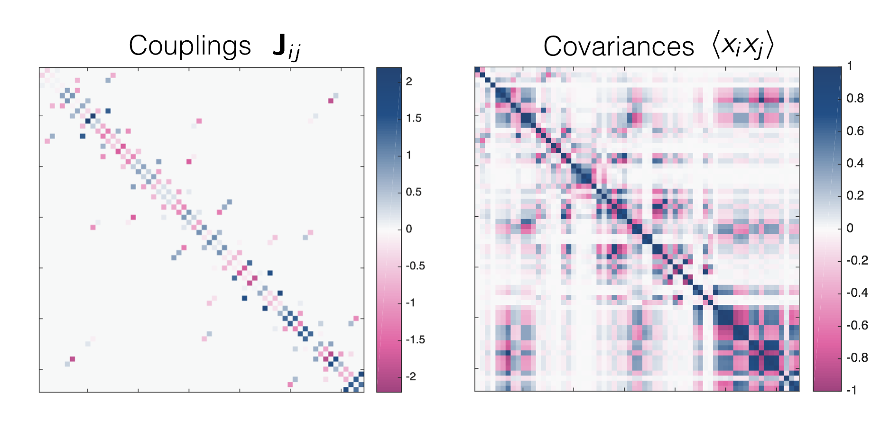

# Persistent Variational Inference
Code for [Variational Inference for Sparse and Undirected Models](http://proceedings.mlr.press/v70/ingraham17a.html) by John Ingraham and Debora Marks, ICML 2017.

This software supports inference of discrete undirected graphical models (UGMs) with pairwise interactions. It provides implementations of standard L1-regularized approximate Maximum Likelihood methods as well as Persistent VI, an algorithm that learns a variational approximation of the posterior of a discrete UGM. It also implements non-centered reparameterizations of sparsity-inducing scale-mixture priors, such as the [Horseshoe](http://proceedings.mlr.press/v5/carvalho09a.html), to do soft variable selection among the interactions ("Fadeout" from the paper).

## Ising models
The `ising` subdirectory contains MATLAB code with MEX subroutines for inferring Ising models.

*Installation*. To setup the Mark Schmidt's mex routines for approximate MAP inference baselines, run `ising/external/L1General/mexAll.m` and `ising/external/minFunc/mexAll.m` in MATLAB. 

The MATLAB script `ising/generate_ising_analysis.m` can be run to create similar experiments as those in the paper. The results may differ some due to randomly sampled synthetic parameters and data.

*Credits* This code uses Mark Schmidt's excellent [minFunc](https://www.cs.ubc.ca/~schmidtm/Software/L1General.html) and [L1General](https://www.cs.ubc.ca/~schmidtm/Software/L1General.html) packages for approximate MAP inference which are included in `ising/external`. 

## Potts models (Proteins)
The `potts` subdirectory contains standalone C code for inferring Potts models as well as MATLAB code for analyzing the results and generating synthetic datasets.

*Installation* To compile the C code, see instructions in `potts/pvi/`.

*Examples* The MATLAB scripts `potts/generate_potts_experiments.m` and `potts/generate_protein_experiments.m` can be run to recreate the potts experiments from the paper.

*Credits* The C code for approximate MAP inference of Potts models uses Naoaki Okazaki's [C implementation of L-BFGS](https://github.com/chokkan/liblbfgs "libLBFGS") as well as a [C implementation of the Mersenne Twister](http://www.math.sci.hiroshima-u.ac.jp/~m-mat/MT/emt.html)